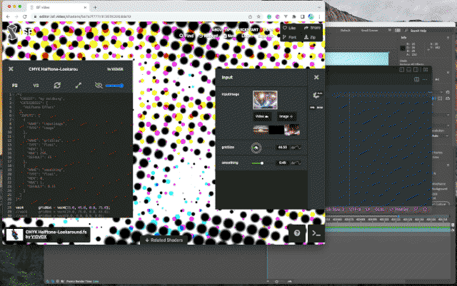

# ISF4AE - Interactive Shader Format for After Effects



After Effects plug-in to allow using a GLSL code written in [Interactive Shader Format](https://isf.video/) as an effect. in short, It's an effect to build effects by yourself -- without struggling with complicated C++ SDK.

## How to Build

1. Download [After Effects Plug-in SDK 2022 Mac - Oct 2021](https://adobe.io/after-effects/).

2. Clone this repo including its submodule, as shown below:

```bash
# At the root folder of SDK
cd Examples/Effect
git clone https://github.com/baku89/ISF4AE.git
cd ISF4AE
git submodule update --init
```

3. Open the Xcode project and build it. The binary will automatically be copied under `/Library/Application Support/Adobe/Common/Plug-ins/7.0/MediaCore/`.

## License

This plug-in has been published under an MIT License. See the included [LICENSE file](./LICENSE).

## Acknowledgments and Inspirations

- [mizt](https://github.com/mizt), [0b5vr](https://0b5vr.com): They gave me many advices for handling AESDK/OpenGL.
- [cryo9](https://github.com/cryo9): His working-in-progress [AE-GLSL](https://github.com/cryo9/AE-GLSL) hinted me for the fundamental idea of this plug-in.
- [Patricio Gonzalez Vivo](https://github.com/patriciogonzalezvivo): One of my reason for being hooked on shaders is his cool project [The Book of Shaders](http://thebookofshaders.com). This plug-in once aimed to support the format of [its editor](http://editor.thebookofshaders.com/).
- [PixelsWorld](https://aescripts.com/pixelsworld/): Scripting environment that supports Lua, GLSL, and shadertoy.com.
- [Pixel Blender Accelator](https://aescripts.com/pixel-bender-accelerator/): A plug-in to run [Pixel Blender](https://en.wikipedia.org/wiki/Adobe_Pixel_Bender), a shader format supported in Adobe products previously, in modern versions of AE.
